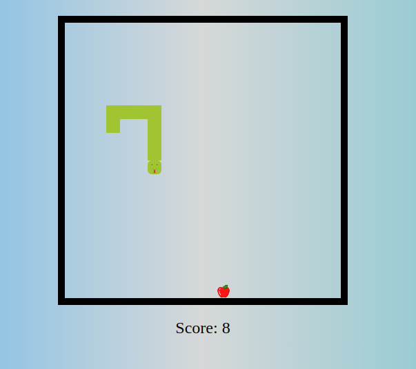
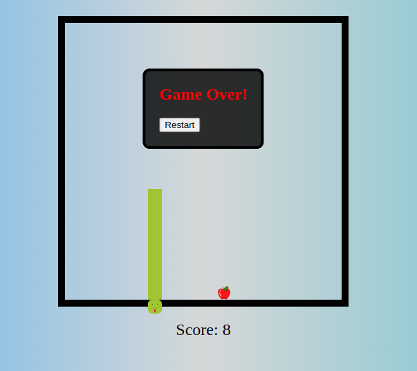

Game Description:
Embark on a nostalgic journey back to the classic era of gaming with Slithering Serpent. Maneuver your snake through a maze of obstacles, gobbling up tasty treats to grow longer and more powerful. But beware! With each bite, your snake grows longer, making navigation trickier. How long can you keep your snake alive and thriving?

Instructions:

Starting the Game: To begin your adventure, press the "Start" button or hit the spacebar on your keyboard.

Movement: Control your snake's movement using the arrow keys on your keyboard. Guide it around the game area, avoiding collisions with walls and, most importantly, with itself.

Eating: Navigate your snake towards the glowing food items scattered throughout the maze. As your snake devours these treats, it grows longer, increasing the challenge of maneuvering without hitting yourself.

Growth and Points: Every time your snake consumes a piece of food, it grows longer. The longer your snake becomes, the higher your score climbs. Keep gobbling up food to reach impressive lengths and scores.

Avoid Collisions: If your snake collides with itself or the walls of the maze, it's game over! Be strategic in your movements and plan ahead to avoid fatal crashes.

Bonus Challenges: Some versions of the game might include bonus challenges, such as timed levels, special power-ups, or additional obstacles. Embrace these challenges for extra excitement and rewards.

Game Over: When your snake meets its unfortunate demise, the game ends. Your final score will be displayed, allowing you to compare your performance with friends and fellow players.

Retry: Don't give up! Press the "Retry" button to start a new game and strive for an even higher score.

Enjoy the Adventure: Above all, have fun! Slithering Serpent is all about enjoying the thrill of classic arcade gaming, testing your reflexes, and embracing the challenge of mastering the snake's movements.

Are you ready to embark on this retro gaming adventure? Start playing Slithering Serpent now and see how long you can keep your snake alive!




**Start the dev server**
```bash
npm run dev
```
### or
```bash
yarn dev
```

**Build files for production**
```bash
yarn build
```
### or

```bash
npm run build
```

**Deploy for production script**
```bash
npm start
```
### or
```bash
yarn start
```